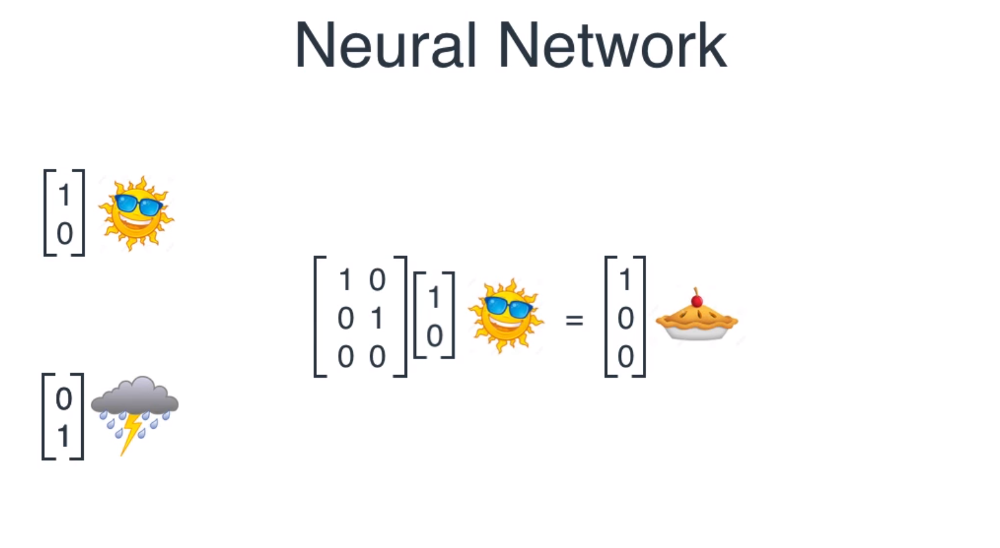

# Deep Learning

---

<!-- .slide: data-background-video="images/space.mp4" data-background-video-loop="true" -->

# Deep Learning

---

## Artificial Intelligence

--

#### What is Artifical Intelligence?
* Using computers to make automated decisions <!-- .element: class="fragment" -->
* For tasks that would require intelligence if done by humans <!-- .element: class="fragment" -->

--

#### Artificial Intelligence Approaches
* Logic and Rules-based approach <!-- .element: class="fragment" -->
  * Top-down rules created for computer
  * Used to automate processes  
* Pattern based approach (Machine Learning) <!-- .element: class="fragment" -->
  * Computers find patterns and infer rules on their own
  * "Learn" from the data to improve over time  
* Hybrid approach <!-- .element: class="fragment" -->
  * Uses both patterns and rules, for complex situations
  * Not all data contains clear patterns

--

#### Use case: Logic and rules
* Business applications

--

#### Use case: Patterns (Machine Learning)
* Automated recommendations
* E-mail spam filters  

<!-- .element style="height: 350px;" -->

--

#### Use case: Hybrids
* Self-driving cars

--

#### The field of Artificial Intelligence

<!-- .element style="height: 350px;" -->

---

## Machine Learning

--

#### What is machine learning?
The reverse of traditional programs. <!-- .element: class="fragment" -->

Traditionally, you define a set of rules to create an algorithm which produces an output. <!-- .element: class="fragment" -->

With machine learning, you define a set of samples, in which the computer finds patterns, which produces an algorithm. <!-- .element: class="fragment" -->

--

#### The kinds of machine learning
* Linear Regression
* Decision Trees
* Clustering
* **(Deep) Neural Networks**

and more.

<aside class="notes">
  2 primary types of machine learning

  supervised learning: humans label test data

  unsupervised learning: machnine finds pattern in unlabeled structured data
</aside>

--

#### Linear regression
Linear regression is a form of Supervised Learning

Used frequently for forecasting data, like stock prices, trends and consumer behavior.

<aside class="notes">
  Linear regression vind een verband tusen een vaste en variablele waarde. dit wordt gebruikt om de toekomst van een grafiek te voorspellen.
</aside>

--

#### Decision Trees
Decision trees are a form of Supervised Learning, used for classification. <!-- .element: class="fragment" -->

They are simple to understand and visualize in a tree. <!-- .element: class="fragment" -->

Therefor, it is more transparent, showing the reasons why it came to a certain decision. <!-- .element: class="fragment" -->

--

#### Clustering
Clustering is a form of Unsupervised Learning.  

Grouping data into distinctive similar areas, by finding relationships and patterns from structured data. <!-- .element: class="fragment" -->

Used in discovering rules or group and partitioning (customer or market segmentation).  
For example, targetted advertisements or bot detection. <!-- .element: class="fragment" -->

---

<!-- .slide: data-background-iframe="https://www.youtube.com/embed/MPU2HistivI" data-background-interactive -->

## Deep Learning <!-- .element: class="fragment fade-out" -->

--

#### What is deep learning?

A neural network with more than 2 layers <!-- .element: class="fragment" -->

Computationally expensive to train <!-- .element: class="fragment" -->

Hard to visualize beyond it's basic form <!-- .element: class="fragment" -->

--

#### Deep learning use cases

* Classification <!-- .element: class="fragment" -->
* Object Detection <!-- .element: class="fragment" -->
* Machine vision <!-- .element: class="fragment" -->

--

#### Deep learning examples

* Voice recognition
* Fraud detection
* Business/economic analysis
* Recommendation engine
* Facial recognition

---

## Neural Networks

--

--

#### Why are neural networks "expensive"?

Neural networks utilize backpropagation to train on sample data. <!-- .element: class="fragment" -->

Backpropegation is achieved with Gradient Descent, which gets exponentially 
more complicated with the amount of neurons. <!-- .element: class="fragment" -->

--

#### Perfect roommate example

The perfect roommate cooks every day. He  can cook pie, burgers and chicken.

--

#### Perfect roommate example

When it's sunny, he cooks a pie, when it's rainy, he cooks a burger.

--

#### Perfect roommate example

Neural Network with weather as input, food as output.

--

#### Perfect roommate example

The food and weather are represented in vectors.

--

#### Perfect roommate example

The output of the network is a vector with the probably of each food item.

--

#### Perfect roommate example

The network operates via simple matrix multiplication.

--

#### Perfect roommate example

---

# Deep Learning Frameworks

--

#### TensorFlow

--

#### Keras

--

#### Deeplearning4j

--

#### Why Deeplearning4j

* Maintained by skymind
* Eclipse Open Source
* Integrated well with Big Data Platform
  * Hadoop
  * Spark
  * Mesos
* Robust
  * 23,000 commits
  * Features in Wired, GigaOM, Businessweek, Wall Street Journal, Fusion and Java Magazine
  * 9,600 stars, 232 contributors

--

#### DL4J in action

---

# Assignments
1. Build an MLP (multilayer perceptron)
    1. ND4J (N-dimensional arrays)
    2. Neural network math
    3. DL4J (Multi-layer Network)
    4. Evaluation
    5. "Learning" with back propagation
    6. Hyper parameters
2. Deeplearnin4j in spring

--

#### Assignment 1
N-dimensional arrays

--

#### Assignment 2
Perfect roommate with ND4J

--

#### Assignment 3
DL4J - Multi Layer Network

--

#### Assignment 4
Evaluation

--

#### Evaluation

* Accuracy <!-- .element: class="fragment" -->
* Precision <!-- .element: class="fragment" -->
* Recall <!-- .element: class="fragment" -->
* F1 Score <!-- .element: class="fragment" -->
* Confusion matrix <!-- .element: class="fragment" -->

<aside class="notes">
  Accuracy: how close evaluation is to expected value

  Precision: The degree to which repeated measurements under the same conditions give us the same results

  Recall: how many positives were predicted correctly (true positive rate)

  F1: Mean score of precision and recall
  
  we see the F1 score used as an overall score on how well our model is performing.
  
  the other scores explain the F1 score
</secion>

--

#### Accuracy vs Precision

--

#### Assignment 5
"Learning" with back propagation

--

#### Assignment 6
Hyper parameters

--

#### Activation functions

#### Stochastic gradient descent

<section class="notes">
  batch gradient descent vs iterative gradient descent (stochastic))
</section>

---

# Sources

* Deep Learning: A Practitioner's Approach (O'Reilly)
* Luis Serrano
* DL4J github

